Raft 工程实践中的注意点


## 双主问题

Raft 写不存在「脑裂」问题。

网络分区场景，旧 leader 收不到更高 term 的 message，依旧在提供服务，并不知道已经选举出新 leader 对外提供服务，出现了两个 StateLeader 的节点。但是 Raft 严格保证同一个 term 只会有一个 leader，不同 term 的 leader 即使共存，也无法同时获取 Quorum 节点提交冲突的数据。所以双主不会导致数据被写坏。

旧 leader 虽然不能写，但它仍然可以响应读请求。如果一个 client 刚在新 leader 上写入成功，转身去旧 leader 上读，却读不到刚写入的数据了，也就是发生了 **Stale Read**。

## Stale Read

单/多 client 读 leader 节点数据，有可能出现写新 Leader 成功，读旧 leader 数据的情况。

业界一般有两种处理思路：

### Lease Read
+ Leader 节点维护一个略小于 election timeout 的 lease，每个 heartbeat 周期向 follower 发送心跳，收到 Quorum ack 续期 lease；follower 在 election timeout 内没收到心跳才会发起选举，这期间是 Lease Read 的安全窗口。
+ 然而正确性依赖于时钟同步，如果 leader 的时钟比 follower 慢，leader 根据本机时钟判断 lease 没有过期，但是 follower 端已经过期，选举为 leader，就会破坏强一致读的保证。

```mermaid
gantt
    title Lease Read 安全窗口
    dateFormat x
    axisFormat %L ms

    section Leader
    heartbeat 1        : milestone, h1, 0, 0
    heartbeat 2        : milestone, h2, 100, 0
    heartbeat 3        : milestone, h3, 200, 0
    lease 有效期    : crit, done, 0, 300

    section Follower
    election timeout（拒绝投票） : active, 0, 300

    section Lease Read
    直接返回本地 committed index（0 RTT） : done, 0, 300
```



### ReadIndex

+ leader 收到读请求，记录 committed index，发心跳确认自己是 leader，等到 apply index >= committed index 返回请求
+ follower 读也是同样的逻辑

Lease Read 用时钟假设换 0 RTT，效率更高；ReadIndex 用一次网络 RTT 换绝对安全。

## StateMachine

### ABA 问题

在 Raft 中，leader 可能在任意时刻发生切换。考虑以下场景：

1. 业务层读取到当前节点是 leader，term = 5，准备提交一个写请求
2. 在提交之前，网络抖动导致 leader 切换：term 变成 6（新 leader），然后又切回来，term 变成 7（本节点重新当选）
3. 业务层调用 Propose(task) 时，节点确实还是 leader，但 term 已经从 5 变成了 7

这是个 ABA 问题，leader 状态没变，但是 term 变化了，内存中的数据可能已经不是最新的了。

braft 的解决方式是在 Propose 的时候带上了 expected_term，进入 propose 队列后校验 current term 和 expected term，不一致会返回错误。

```cpp
void NodeImpl::apply(const Task& task) {
  LogEntry* entry = new LogEntry;
  entry->AddRef();
  entry->data.swap(*task.data);
  LogEntryAndClosure m;
  m.entry = entry;
  m.done = task.done;
  m.expected_term = task.expected_term;
  if (_apply_queue->execute(m, &bthread::TASK_OPTIONS_INPLACE, NULL) != 0) {
    task.done->status().set_error(EPERM, "Node is down");
    entry->Release();
    return run_closure_in_bthread(task.done);
  }
}
```

### noop 日志

Raft 论文里的一个关键约束：leader 只能提交本 term 的日志，不能直接提交前任 term 的日志。新 leader 在 noop commit 之前，不能响应任何读请求，否则可能读到旧数据。

```go
// stepLeader 处理 MsgReadIndex
if !r.committedEntryInCurrentTerm() {
    // Noop 还没 commit, 先 pending, 等 Noop commit 后再处理
    r.pendingReadIndexMessages = append(r.pendingReadIndexMessages, m)
    return nil
}
```

## snapshot

snapshot 和日志要配合保证整体的数据一致性；快照本身比较耗时，需要异步实现。

## 成员变更

「Joint Consensus」分为两个阶段是为了避免 Cold 和 Cnew 各自形成不相交的多数派。生产中推荐每次只变更一个节点，这样的操作本身就能够满足「Cold 与 Cnew 无法独自形成多数派」。


### 扩容

+ 进程启动时不传入成员列表，直接以空的状态启动。由于没有成员列表，进程无法成为 raft leader，管控服务通过成员变更先将节点以 learner 角色加入 raft 组，追齐数据后提升为 follower。这种模式甚至可以支持 (A,B,C) -> (D,E,F) 的替换。

### 缩容

+ 至少保证多数派节点健康，leader 缩容前先调用 transfer leader 减少服务不可用时间。

### 单副本恢复集群服务

+ 本质上是放弃 Consistency，换取 Availability
+ 重写成员列表，只保留单节点成员，bootstrap 集群恢复服务，流程参考 etcdctl snapshot restore、braft reset_peer，都是一样的思路
