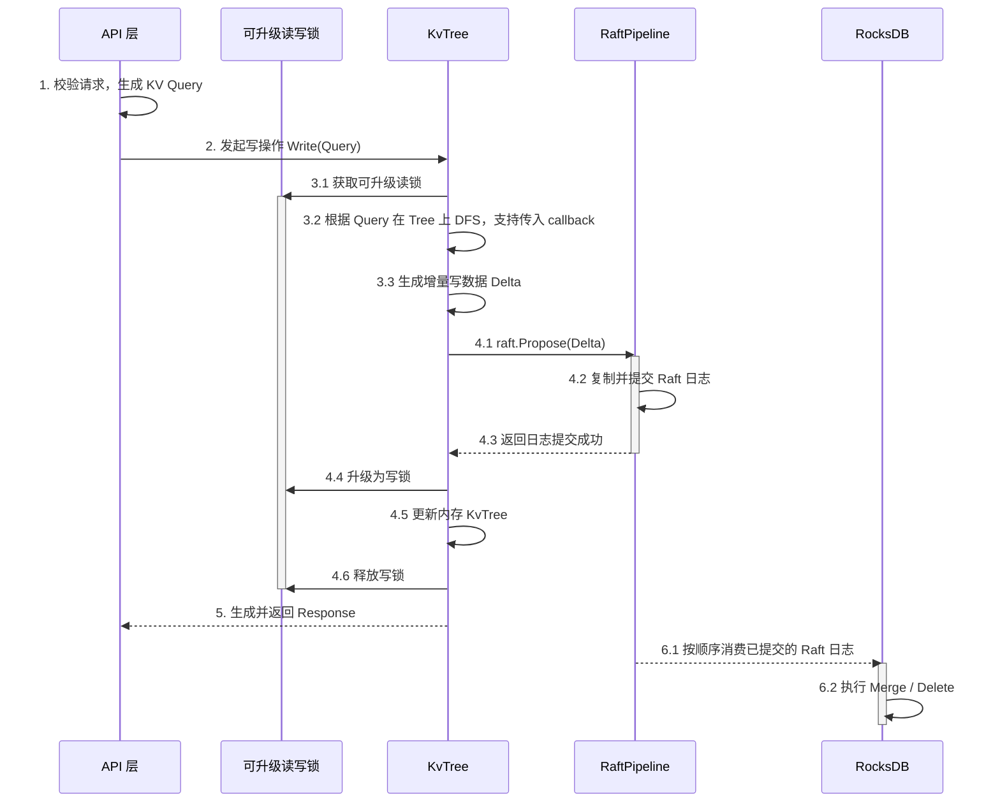
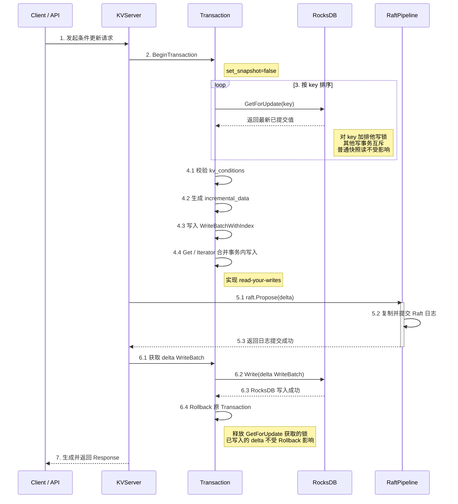
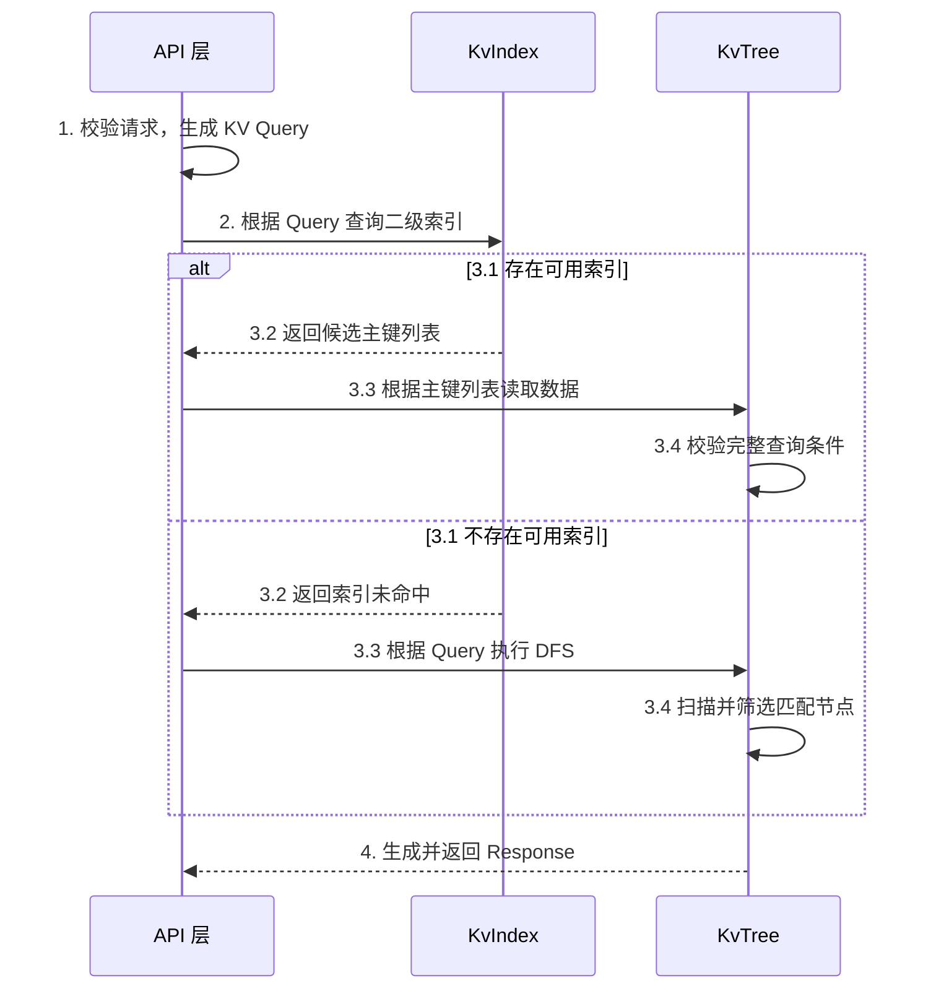
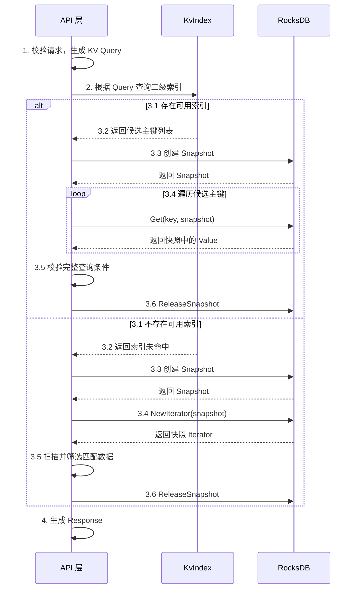

## 条件更新

KV 存储的条件更新类比下面的 SQL：把 `machine` 表中 `state == GOOD` 的值更新成 `BAD`。

```sql
UPDATE machine SET state = 'BAD'
WHERE state = 'GOOD';
```

实现条件更新（Compare And Set）最简单的办法是全程持有写锁，一旦包含磁盘 I/O、Raft 复制（网络 I/O）等耗时操作，写锁持有时间太长会阻塞读操作。比较理想的做法是持久化阶段不加写锁，只在更新内存数据时持有写锁，提升并发性能。

常见的几种做法：

### 可升级的读写锁

普通的读写锁（Go sync.RWMutex）不支持原子地从读锁升级成写锁，可以通过增加一把 `Mutex` 互斥锁实现「可升级的读写锁」。

```text
lock sync.RWMutex
writeLock sync.Mutex
```

读锁: 多个线程可以获取多个读锁同时读
```
lock.RLock()
```
可升级的读锁：只有一个线程可以获取可升级的读锁
```
writeLock.Lock()
```
读锁升级成写锁：此时没有其他线程拥有读锁、可升级的读锁和写锁
```
lock.Lock()
```
写锁：获取写锁的过程也可以看做先获取可升级的读锁，再把读锁升级成写锁
```
writeLock.Lock()
lock.Lock()
```

如果不希望其他写线程阻塞在 `writeLock.Lock()`，可以使用 `TryLock` 或者 `atomic` 资源状态，实现抢占写锁失败立即返回冲突，在业务层提示或者重试。

### MVCC

Rocksdb 实现了 MVCC，每次写入会生成一个单调递增的 sequence number，RocksDB 创建 snapshot 会记录当前的 sequence number。之后的读取只返回不大于该 sequence number 的最新版本。
```
key=A, seq=10, value=GOOD
key=A, seq=20, value=BAD

snapshot(seq=15) -> GOOD
最新读取         -> BAD
```
因此，写线程可以继续追加新版本，读线程则从 snapshot 读取旧版本，双方不需要通过行锁互斥。
`GetForUpdate` 的排他锁主要用于阻止其他事务对 key 的写，不影响读，效果上和可升级的读写锁基本是一致的。

### CoW

另一种选择是 Copy-on-Write：写者复制并修改一份不可变数据，最后通过原子指针 Swap 新版本数据，读者始终访问完整快照。它适合读多写少、数据量较小的场景，否则复制成本和瞬时内存占用会比较高。典型的场景是 bbolt 中的 CoW B+Tree。


## 写操作

### 内存 KV


* Rocksdb 的 Merge Operator （追加 operand，延迟合并）可以实现 protobuf Value 的字段级增量更新
* leader 和 follower 在 raft apply 中对于日志应用到状态机的处理不同，leader 由于需要生成 response，apply 状态机可以交由 API 层的线程池提高并发

### Rocksdb KV



* 内存中只保留索引，不保留全量 KvTree
* `GetForUpdate` 不会阻塞已经固定版本的快照读
* Transaction 只用了锁管理的能力，没有用到事务的 commit，因为 raft log 依赖业务语义 diff 以及在 raft 持久化前无法获取 index、timestamp 等信息

## 读操作

### 内存 KV


* 二级索引的示例结构 `IndexNode("cluster").mValues["c1"] -> {m1, m2, m3}` 
  
### Rocksdb KV



* MVCC 读固定版本，读不阻塞写


## 总结

KV 并发主要解决两个问题：一次读取过程中数据被修改怎么办，多个写操作同时基于同一个旧值更新怎么办。
前一个问题由 MVCC、Snapshot 或 CoW 解决，让一次读取始终看到同一个版本；后一个问题由锁、write intent 或提交时的冲突检查解决，保证多个条件更新中只有一个能够成功。

悲观并发控制是在执行前占住写入权直到持久化完成，适合冲突较多的场景；乐观并发控制允许并行执行，到提交时发现版本变化再重试，适合冲突较少的场景。Raft 则负责把最终确定的写入按相同顺序复制到各个副本，实现多副本的数据一致。